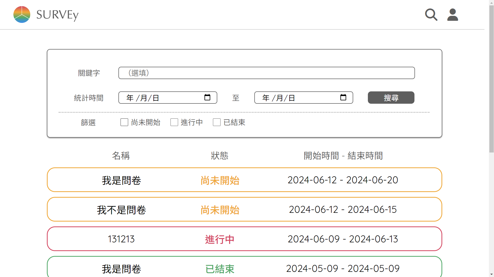

# 動態問卷(前端)
## 使用工具
前端：Vue、JavaScript、HTML、SCSS

[後端](https://github.com/Yuuquoi/survey)：Java、Spring Boot、MySQL

## 畫面呈現
### 首頁

### 搜尋

### 會員

### 結果統計


## 功能呈現
### 新增、編輯問卷

### 搜尋和篩選功能

### 根據會員和問卷狀態顯示功能
#### 非會員 && 問卷狀態為開放中

#### 非會員 && 問卷狀態為已結束或尚未開放

#### 會員 && 問卷狀態為尚未發布或尚未開始

#### 會員 && 問卷狀態為進行中

#### 會員 && 問卷狀態為已結束


## 設置 ( Setup )
```sh
npm install
```
### Compile and Hot-Reload for Development
```sh
npm run dev
```
### Compile and Minify for Production
```sh
npm run build
```
"# QuestionnaireWeb" 
